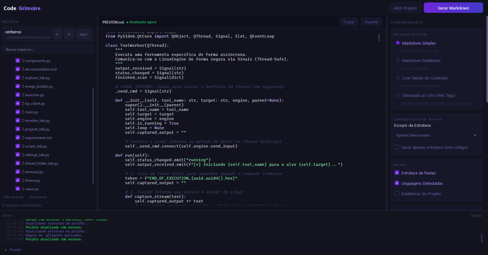

# CodeGrimoire

**Preparador de contexto RAG e analisador estrutural de sistemas para Inteligência Artificial.**

O CodeGrimoire é uma ferramenta open-source desenvolvida para resolver o problema da **fragmentação de contexto** ao interagir com Modelos de Linguagem de Larga Escala (LLMs). Ele transforma o código disperso de um repositório em um Grafo de Conhecimento Estruturado, otimizando o entendimento da IA sobre a arquitetura do seu software.

---

## Interface do Sistema



---

## O Problema que Resolvemos

LLMs têm dificuldades com "contextos sujos". Enviar múltiplos arquivos sem conexão lógica exige alto esforço cognitivo do modelo, gastando tokens desnecessários e gerando alucinações. 

O CodeGrimoire resolve isso atuando como uma ponte de **Retrieval-Augmented Generation (RAG) estático**. Ele aplica minificação, filtragem inteligente e **Análise Estrutural Semântica**, entregando à IA um mapa mental da arquitetura antes de fornecer o código.

---

## Principais Funcionalidades

### Inteligência de Contexto (RAG)
- **Classificação Heurística:** Analisa nomes e caminhos de arquivos para deduzir seus papéis arquiteturais (Ex: `Entrypoint`, `Lógica de Negócio`, `Interface de Usuário`, `Banco de Dados`).
- **Mapeamento de Dependências (Python AST):** Lê a Árvore Sintática (AST) dos arquivos Python para gerar um mapa preciso de quais módulos internos cada script importa, criando uma visão clara do fluxo de dados.

### Otimização de Tokens
- **Remoção Segura de Comentários:** Limpa comentários de linha em diversas linguagens (JS, TS, Python, Java, C++, etc.) preservando strings e a lógica do código.
- **Minificação Espacial:** Remove espaços invisíveis e quebras de linha em excesso, economizando tokens valiosos no *context window* da IA.
- **Formato Otimizado (XML Tags):** Opção de gerar o documento final usando tags XML (`<project>`, `<file>`, `<depends_on>`), formato altamente eficiente para o parsing de LLMs modernos.

### Explorador e Produtividade
- **Auto-Filtro via `.gitignore`:** Detecta e aplica automaticamente as regras do seu `.gitignore` para ocultar pastas pesadas como `node_modules` e ambientes virtuais.
- **Divisão Inteligente (Chunking):** Permite dividir projetos massivos em múltiplas partes (Arquivos Markdown separados) com base em um limite de linhas configurável.
- **Presets Salvos:** Salve suas seleções de arquivos mais frequentes e recarregue-as com um clique.
- **Histórico de Projetos:** Acesso rápido aos repositórios recentes direto na interface.

---

## Instalação e Execução

### Opção 1: Executável para Windows (Recomendado)
Se você usa Windows, não é necessário instalar o Python ou configurar nada.
1. Acesse a aba de **[Releases](https://github.com/matheusaraujoc/Code-Grimoire/releases)** aqui no GitHub.
2. Baixe o executável mais recente (ex: `CodeGrimoire.exe` ou o arquivo `.zip`).
3. Dê um duplo clique no arquivo baixado e comece a usar!

> ⚠️ **Aviso do Windows (SmartScreen):** Como este é um projeto independente e o executável não possui um certificado digital pago, o Windows Defender pode exibir uma tela azul informando que "O Windows protegeu o seu computador" na primeira execução. Isso é um falso-positivo comum. Para abrir o programa, basta clicar em **Mais informações** e depois em **Executar assim mesmo**.

### Opção 2: A partir do código-fonte (Desenvolvedores / Linux / macOS)
Se preferir rodar via código ou se estiver em outro sistema operacional, siga os passos abaixo:

### Pré-requisitos
- **Python 3.9** ou superior.
- Sistema Operacional: Windows, macOS ou Linux.

### Passo a Passo

1. Clone este repositório:
   ```bash
   git clone [https://github.com/seu-usuario/CodeGrimoire.git](https://github.com/seu-usuario/CodeGrimoire.git)
   cd CodeGrimoire
   ```

2. Crie e ative um ambiente virtual:
   ```bash
   python -m venv venv
   
   # No Windows:
   venv\Scripts\activate
   # No Linux/macOS:
   source venv/bin/activate
   ```

3. Instale as dependências:
   ```bash
   pip install PySide6
   ```

4. Execute a aplicação:
   ```bash
   python main.py
   ```

---

## Estrutura do Projeto

- `main.py`: Orquestração da UI e Worker de geração (QThread).
- `analyzer.py`: Motor de Inteligência de Contexto (Heurísticas e AST).
- `theme.py`: Estilização QSS, cores de sintaxe e ícones base64.
- `widgets.py`: Componentes reaproveitáveis da interface gráfica.

---


# Documentação
---

## 1. Arquitetura do Sistema
O projeto segue uma arquitetura modularizada, separando a interface gráfica da lógica de processamento pesado.

### Estrutura de Arquivos
```text
CodeGrimoire/
├── main.py       # Ponto de entrada, orquestração da UI e Worker de geração.
├── analyzer.py   # Motor de Inteligência de Contexto (Heurísticas e AST).
├── theme.py      # Estilização QSS, cores de sintaxe e injeção de ícones Base64.
├── widgets.py    # Componentes reutilizáveis (StatCards, Logs, Highlighters).
└── README.md     # Documentação oficial.
```

### Componentes Principais
* **UI Thread (PySide6):** Gerencia a interface gráfica dividida em três painéis principais: Explorador (Esquerda), Preview (Centro) e Configurações (Direita).
* **GeneratorWorker (QThread):** Thread dedicada que realiza a leitura de arquivos, limpeza de comentários, minificação e construção do Markdown/XML em *background*, evitando o congelamento da interface.
* **Context Engine (`analyzer.py`):** Módulo de análise estática responsável por deduzir o papel de cada arquivo na arquitetura e mapear suas dependências.

---

## 2. Motor de Inteligência de Contexto (RAG)
O grande diferencial do CodeGrimoire é a sua capacidade de explicar o sistema para a IA. Isso é feito através de duas abordagens no módulo `analyzer.py`:

### 2.1. Classificação Heurística de Papéis
O sistema analisa o nome do arquivo e seu caminho (`filepath`) para deduzir sua função arquitetural baseando-se em padrões da indústria.
* **Entrypoint:** Arquivos como `main.py`, `app.py`, `index.js`.
* **Lógica de Negócio:** Pastas contendo `services`, `controllers`, `usecases`.
* **Dados:** Pastas/arquivos com `model`, `db`, `repository`.
* **UI/UX:** Arquivos contendo `theme`, `widgets`, `view`.
* **Documentação:** Arquivos `.md` ou `.txt`.

### 2.2. Mapeamento de Dependências (Python AST)
Em vez de usar Expressões Regulares (que são frágeis para análise de código), o CodeGrimoire utiliza a biblioteca nativa `ast` (Abstract Syntax Tree) do Python.
* O sistema lê cada arquivo `.py` do projeto e o converte em uma árvore sintática.
* Ele varre os nós do tipo `Import` e `ImportFrom`.
* **Filtragem Inteligente:** O motor cruza os imports encontrados com a lista de arquivos do próprio projeto, descartando bibliotecas externas (como `os`, `sys`, `requests`). O resultado é um mapa preciso de quais módulos internos cada arquivo depende.

---

## 3. Funcionalidades de Processamento

### 3.1. Filtros e Ignorados
* **Auto-detecção via `.gitignore`:** O sistema lê automaticamente o `.gitignore` na raiz do projeto e usa a biblioteca `fnmatch` para ignorar pastas pesadas (`node_modules`, `.venv`, `__pycache__`) sem intervenção do usuário.
* **Filtros Manuais:** Campo customizável para adicionar ignorados extras sob demanda.

### 3.2. Otimização de Contexto (Token Saving)
* **Remoção de Comentários:** Expressões regulares seguras removem comentários de linha única (suporte a JS, TS, Python, C++, Java, etc.), preservando strings e lógicas.
* **Minificação Espacial:** Remove quebras de linha duplas/triplas e espaços em branco no final das linhas (`trailing spaces`), reduzindo drasticamente o consumo de tokens.

### 3.3. Divisão Inteligente (Chunking)
Para modelos com janelas de contexto limitadas, o usuário pode definir um limite aproximado de linhas. O `GeneratorWorker` divide a saída em múltiplas partes (Ex: Parte 1, Parte 2), exportáveis individualmente ou em lote (`.md`, `.txt`, `.xml`).

---

## 4. Estrutura do Documento Gerado
O CodeGrimoire permite ao usuário escolher entre formatos amigáveis para leitura humana (Markdown Detalhado) ou otimizados para LLMs (XML Tags).

**Exemplo de Saída (Modo Otimizado para IA):**
```xml
<project=MeuApp>
<tree>
├── main.py
├── src/
│   ├── database.py
│   └── utils.py
</tree>

<structural_analysis>
<file path="main.py">
  <role>Entrypoint (Ponto de Entrada / Inicialização)</role>
  <depends_on>database,utils</depends_on>
</file>
<file path="src/database.py">
  <role>Dados / Acesso a Banco</role>
  <depends_on>none</depends_on>
</file>
</structural_analysis>

<main.py>
import database
import utils
def iniciar():
    db = database.conectar()
    utils.log("Iniciando")
<src/database.py>
def conectar():
    return "Conexão OK"
```

---

## 5. Fluxo de Execução de Estado
O sistema é projetado para ser resiliente e manter o estado das sessões do usuário:
1.  **Abertura de Projeto:** O usuário seleciona uma pasta. O caminho é salvo em `~/.codegrimoire_history.json`.
2.  **Construção da Árvore:** O `.gitignore` é lido, e a `QTreeWidget` é populada, mantendo controle de estado *TriState* (Marcado, Desmarcado, Parcial).
3.  **Presets:** Seleções frequentes de arquivos podem ser salvas com um nome customizado em `~/.codegrimoire_presets.json`.
4.  **Geração:** O clique no botão dispara o `GeneratorWorker`, que emite sinais (`Signal`) para atualizar o `StatusWidget` e o `LogsPanel` na thread principal ao finalizar.

---

## 6. Requisitos e Execução

### Requisitos de Sistema
* **Python:** 3.9 ou superior (devido ao uso extensivo de *type hints* e melhorias no módulo `ast`).
* **Bibliotecas:** `PySide6` (Interface Gráfica).
* **OS:** Cross-platform (Windows, macOS, Linux). Suporte especial ao Windows AppUserModelID para ícones na barra de tarefas.

### Instalação
1. Clone o repositório ou baixe o código fonte.
2. Crie um ambiente virtual (recomendado):
   ```bash
   python -m venv venv
   # Windows: venv\Scripts\activate
   # Linux/Mac: source venv/bin/activate
   ```
3. Instale as dependências:
   ```bash
   pip install PySide6
   ```
4. Execute o programa:
   ```bash
   python main.py
   ```

---

## 9. Licença e Autoria
**Autor:** Matheus Araújo (Estudante de Ciência da Computação - UESPI Campus Parnaíba).
**Licença:** Distribuído para fins de estudo e uso pessoal. Contribuições, *issues* e *pull requests* são bem-vindos para expandir a capacidade analítica da ferramenta.